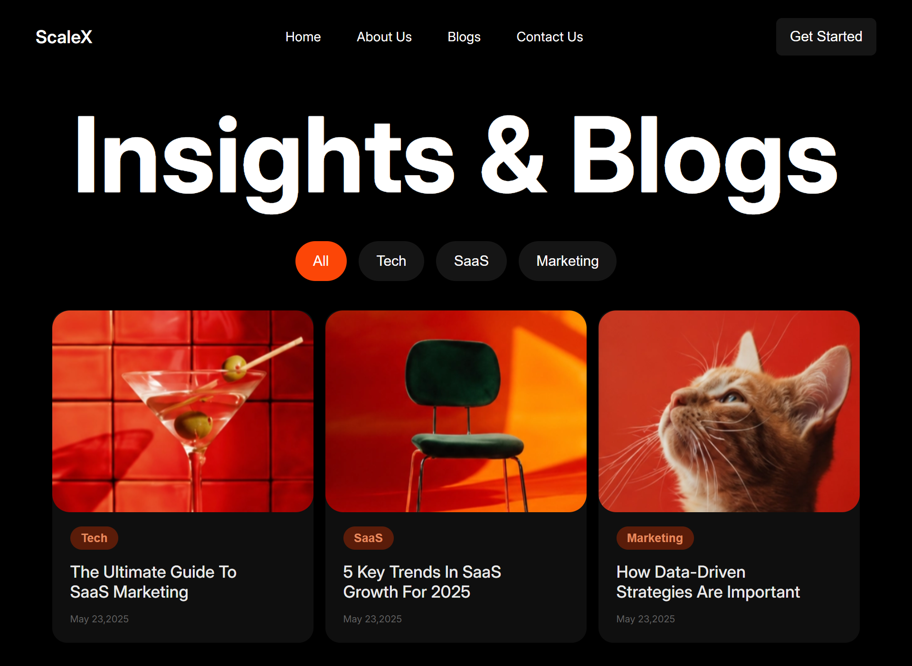

# ScaleX Blog Landing Page



A modern blog landing page UI built using semantic HTML and CSS.  
This project was created as part of my frontend practice while learning web development from Sheriyans Coding School Cohort 3.0.

---

## Tech Stack

- HTML5
- CSS3
- Flexbox
- Google Fonts (Inter)

---

## Features

- Semantic HTML structure
- Modern UI design
- Reusable card components
- Smooth hover effects
- Open Graph meta tags
- SEO-friendly metadata
- Clean layout architecture

---

## Concepts Practiced

- Flexbox layouts
- Component-based thinking
- Semantic HTML
- Spacing & alignment systems
- Typography hierarchy
- UI decomposition
- SEO basics
- Open Graph metadata

---

## Project Structure

```bash
scalex-blog-landing-page/
│
├── index.html
├── style.css
├── preview.png
├── tech.png
├── sass.png
└── marketing.png
```

---

## [Live Demo](https://harshaweb09.github.io/scalex-blog-landing-page/)
